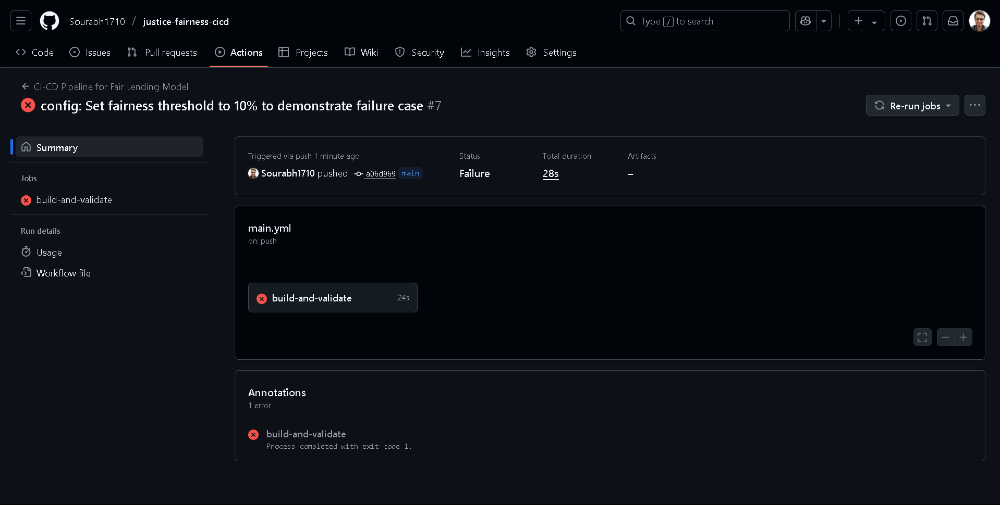

# Project Sentinel: An Anti-Bias CI/CD Pipeline for Criminal Justice

*An end-to-end MLOps project that builds an automated CI/CD pipeline with a built-in "fairness gate" to prevent the deployment of racially biased AI models.*


---

### **Live Pipeline in Action**

**A biased model is automatically blocked by the pipeline (The "Failure" is a Success!):**


**A validated, fair model is approved and versioned by the pipeline:**


---

### Table of Contents
* [Problem Statement](#problem-statement)
* [Key Features](#key-features)
* [Tech Stack](#tech-stack)
* [Key Results & Business Impact](#key-results--business-impact)
* [How to Run This Project](#how-to-run-this-project)
* [Project Structure](#project-structure)

---

### Problem Statement

In the criminal justice system, risk assessment algorithms are used to predict the likelihood of a defendant re-offending (recidivism). While intended to improve decision-making, these models can inadvertently learn and perpetuate historical biases from their training data. A landmark 2016 investigation by ProPublica revealed that the COMPAS algorithm was significantly biased against Black defendants, posing enormous ethical, social, and legal risks.

The objective of this project is to move beyond post-deployment audits and build an **accountable AI system by design**. The goal is to create an automated MLOps pipeline that serves as a "sentinel," ensuring that no model exhibiting significant racial bias can ever be approved for deployment.

---

### Key Features
*   **Automated CI/CD Pipeline:** Built a complete CI/CD pipeline using **GitHub Actions** that automatically triggers on every code change to retrain, test, and validate the model.
*   **The "Fairness Gate":** The core of the project. A validation script that runs as a mandatory step in the pipeline. It uses the **Fairlearn** library to calculate the **Demographic Parity** of the model's predictions across different racial groups.
*   **Conditional Logic & Deployment Control:** The pipeline is configured to fail intentionally if the model's bias exceeds a defined threshold. This action automatically **blocks the model from being versioned** or deployed, providing a robust, automated ethical safeguard.
*   **Model Versioning for Approved Models:** If a model successfully passes both performance and fairness checks, it is automatically saved and uploaded as a build **artifact** on GitHub, making it a versioned, deployable candidate.
*   **Configurable & Reproducible:** The entire workflow is defined in code, from the fairness thresholds in `config.py` to the pipeline steps in `main.yml`, making the process transparent and fully reproducible.

---

### Tech Stack


---

### Key Results & Business Impact

The primary "business impact" of Project Sentinel is not revenue generation but **risk mitigation**. By automatically enforcing ethical constraints, the system directly reduces legal, reputational, and social harm.

> **Demonstrating the Fairness Gate:**
> *   **Scenario 1 (Default):** With a fairness threshold of 10%, our trained model exhibited a **22.9%** bias (Demographic Parity Difference). The pipeline correctly identified this and **FAILED** the run, preventing the biased model's deployment.
> *   **Scenario 2 (For Demonstration):** By increasing the threshold to 25%, the same model was now considered "fair" under the new rule. The pipeline **PASSED** the run and successfully uploaded the model as a validated artifact.

This demonstrates a robust, automated governance system that is both effective and auditable.

---

### How to Run This Project

Follow these steps to set up and run the project on your local machine.

1.  **Clone the Repository:**
    ```bash
    git clone https://github.com/<YOUR_USERNAME>/<YOUR_REPO_NAME>.git
    cd <YOUR_REPO_NAME>
    ```

2.  **Create and Activate a Virtual Environment:**
    ```bash
    # Create the virtual environment
    python -m venv venv

    # Activate it
    # On Windows (in cmd or PowerShell):
    .\venv\Scripts\activate
    # On macOS/Linux:
    source venv/bin/activate
    ```

3.  **Install Dependencies:**
    All the required libraries are listed in the `requirements.txt` file.
    ```bash
    pip install -r requirements.txt
    ```
4.  **Download Data:** Download the `compas-scores-two-years.csv` file from the [ProPublica COMPAS GitHub repository](https://github.com/propublica/compas-analysis/blob/master/compas-scores-two-years.csv) and place it in the root directory of this project.


5.  **Run the pipeline scripts in order:**
    ```bash
    # 1. Preprocess the raw data into a clean file
    python src/preprocess_data.py

    # 2. Train the model on the clean data
    python src/train_model.py

    # 3. Validate the newly trained model for fairness
    python src/validate_fairness.py
    ```

6.  **Experiment:** Change the `DEMOGRAPHIC_PARITY_THRESHOLD` value in `src/config.py` from `0.10` to `0.25` and re-run the validation script to see the outcome flip from "FAILED" to "PASSED".

---

### Project Structure
```
        justice-fairness-cicd/
    ├── .github/
    │ └── workflows/
    │ └── main.yml # The GitHub Actions CI/CD pipeline definition
    ├── data/
    │ └── processed/
    │ └── compas_cleaned.csv # The cleaned data used for training
    ├── src/
    │ ├── init.py
    │ ├── config.py # Central configuration for paths and thresholds
    │ ├── preprocess_data.py # Script for data cleaning and preparation
    │ ├── train_model.py # Script for model training and serialization
    │ └── validate_fairness.py # Script for fairness validation (the "gate")
    ├── tests/ # Placeholder for future unit tests
    ├── .gitignore
    ├── README.md # This file
    └── requirements.txt # List of Python dependencies

```


---

## 👤 Author
**Sourabh Sonker**                                                                                                                 
**Aspiring Data Scientist**